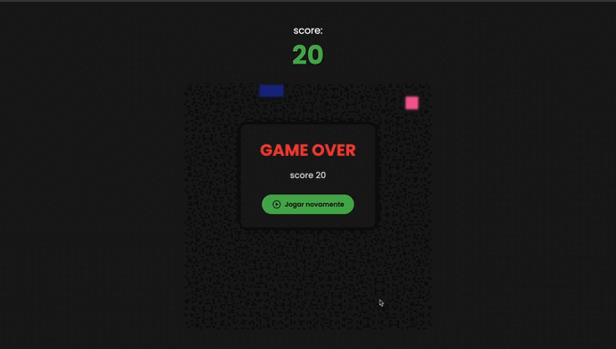

# 🐍 Snake Game

A classic Snake game recreated using **HTML5**, **CSS3**, and **JavaScript**, leveraging the `<canvas>` element to draw and animate the snake in real time. Simple, straightforward, and with sound!

---

## How to Play

* Use the **arrow keys** or **WASD** to control the snake's direction.
* Eat the food to increase your score and grow.
* Avoid hitting the walls or yourself.

---

## 📁 Project Structure

```
snake-game/
├── assets/
│   └── audio.mp3         # Sound when eating food
├── css/
│   └── style.css         # Game styling
├── js/
│   └── script.js         # Core game logic
├── index.html            # Main page
└── README.md             # Project documentation
```

---

## Technologies Used

* **HTML5**: page structure and canvas
* **CSS3**: visuals and layout
* **JavaScript**: game logic (movement, scoring, collisions)
* **Audio**: sound effect when eating food

---

## ▶ How to Run

1. Clone this repository:

   ```bash
   git clone https://github.com/your-username/snake-game.git
   ```

2. Navigate into the folder:

   ```bash
   cd snake-game
   ```

3. Open `index.html` in your browser or use an extension like **Live Server** in VSCode.

---

## 📸 Preview

> 

---

## Features

* Real-time scoring
* Keyboard control (arrows or WASD)
* Collision detection
* Audio feedback when eating

---

## Author

Developed by [Gabriel Logan](https://github.com/logangaabriel).
